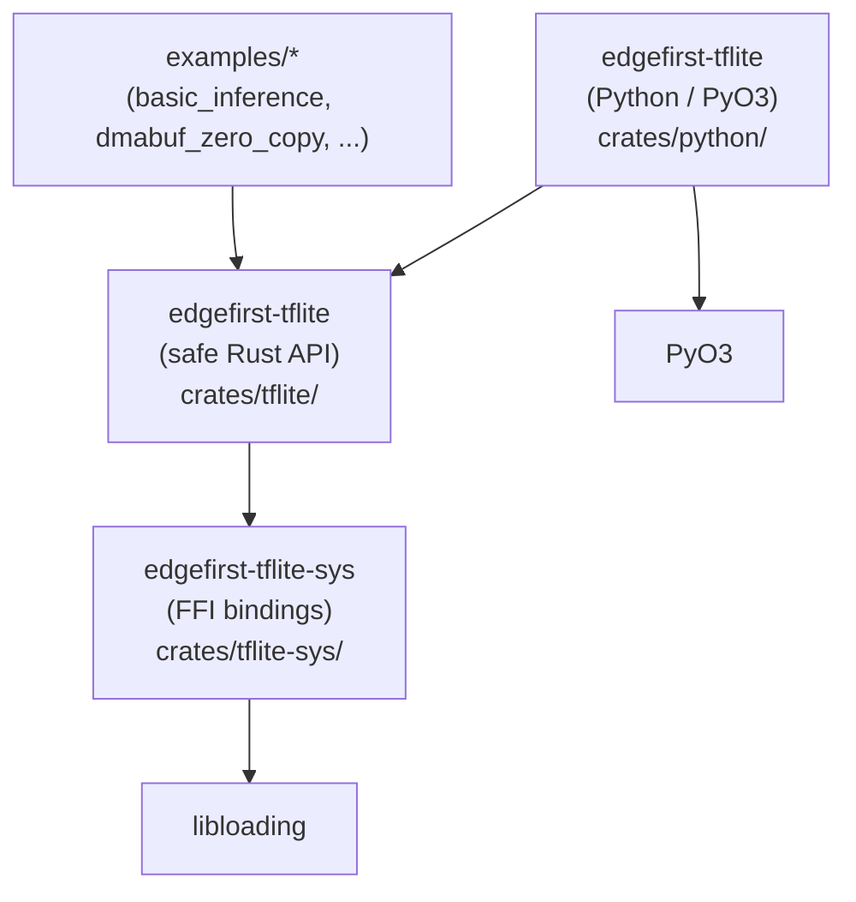
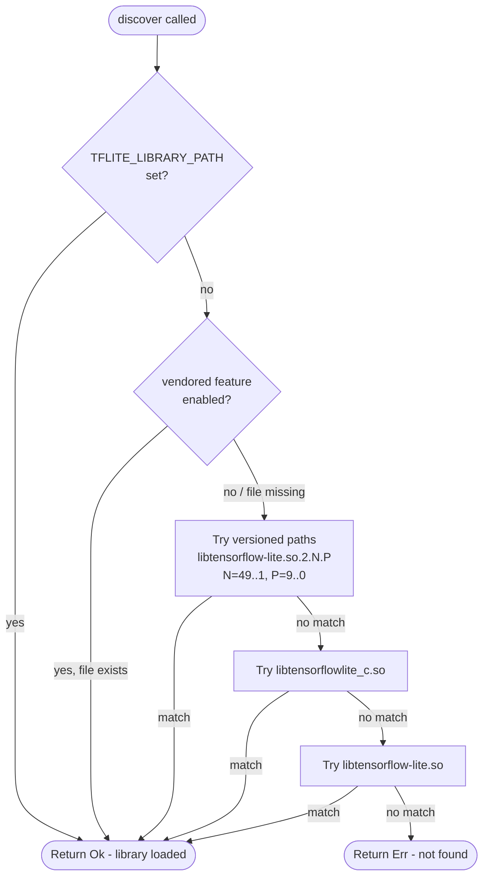
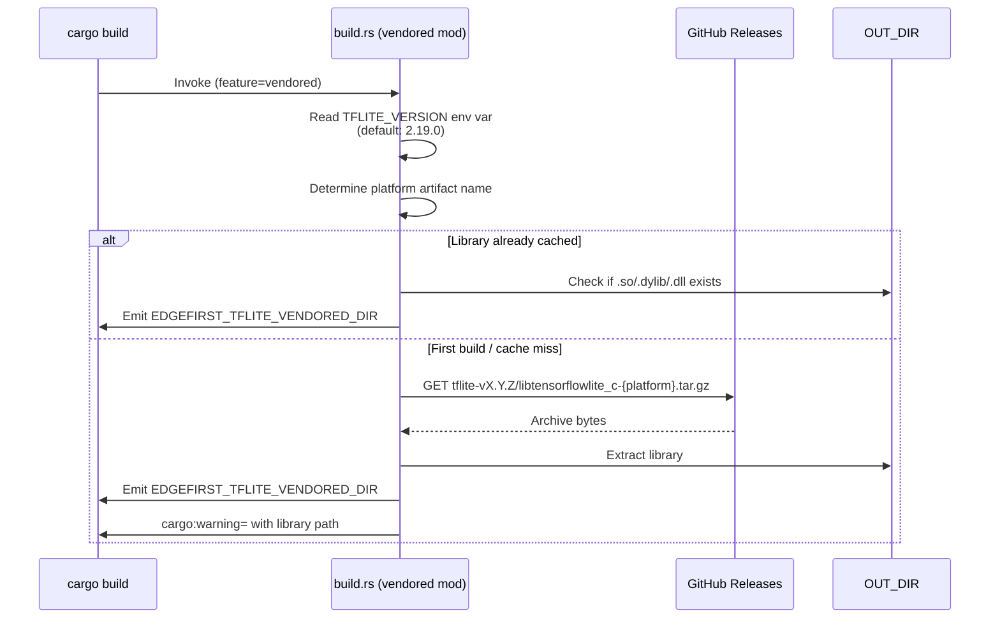

# Architecture

## Crate Dependency Graph



## Crate Structure

```
edgefirst-tflite          (safe API)
  └─ edgefirst-tflite-sys (FFI bindings)
       └─ libloading      (runtime symbol loading)

edgefirst-tflite          (Python bindings, crates/python/)
  └─ edgefirst-tflite     (safe API, re-used)
  └─ pyo3
```

### `edgefirst-tflite-sys`

Low-level FFI plumbing. No safe wrappers.

- **`ffi.rs`** -- `bindgen`-generated struct with 164 function pointers,
  loaded at runtime via `libloading` (`--dynamic-loading`).
- **`discovery.rs`** -- Library discovery with 4-step priority chain (see below).
- **`hal_ffi.rs`** -- Function pointer structs for the HAL Delegate DMA-BUF
  and CameraAdaptor C APIs (`hal_dmabuf_*`, `hal_camera_adaptor_*`), as
  defined in `edgefirst-hal-capi` (`hal.h`). Also defines `HalDtype`,
  `HalDmabufTensorInfo`, and `HalCameraAdaptorFormatInfo` — the stable C ABI
  types shared across all delegate implementations.
- **`vx_ffi.rs`** -- Function pointer structs for the legacy `VxDelegate`
  DMA-BUF and `CameraAdaptor` C APIs. These are probed as a fallback for
  delegates that have not yet adopted the HAL API.

### `edgefirst-tflite`

Ergonomic, safe Rust API. This is the primary user-facing crate.

- **`library.rs`** -- `Library` wraps the sys-level FFI handle.
- **`model.rs`** -- `Model` loads TFLite models from files or byte buffers.
- **`interpreter.rs`** -- `InterpreterBuilder` (builder pattern) and
  `Interpreter` for running inference.
- **`tensor.rs`** -- `Tensor` / `TensorMut` for type-safe tensor access.
- **`delegate.rs`** -- `Delegate` loads hardware acceleration delegates and
  probes for HAL Delegate and legacy `VxDelegate` extension APIs.
- **`dmabuf.rs`** -- `DmaBuf` for zero-copy DMA-BUF operations (feature-gated).
- **`camera_adaptor.rs`** -- `CameraAdaptor` for NPU preprocessing (feature-gated).
- **`metadata.rs`** -- `Metadata` extraction from model files (feature-gated).

## Runtime Symbol Loading

Symbols are resolved **at runtime**, not link-time. `bindgen --dynamic-loading`
generates a `tensorflowlite_c` struct where each TFLite C API function is a
field containing a function pointer. The struct is instantiated with
`tensorflowlite_c::new(path)` (unsafe), which resolves all required symbols
at once via `libloading`.

This design means:
- No link-time dependency on a TFLite shared library — the binary compiles
  without TFLite installed.
- The same binary works across TFLite versions and platforms without
  recompilation.
- Missing or incompatible libraries produce clear runtime errors instead of
  silent linker failures.

`Library` in `crates/tflite/src/library.rs` wraps this struct and is the only
entry point. All call sites access TFLite symbols through `Library::as_sys()`.

## Library Discovery Mechanism

`discovery::discover()` in `crates/tflite-sys/src/discovery.rs` searches for
the TFLite shared library in 4 steps:



**Step 1 — `TFLITE_LIBRARY_PATH` env var:** If set, the library is loaded
from that exact path and no further probing occurs. Useful for CI, containers,
and testing alternative library versions.

**Step 2 — Vendored path:** When built with `--features vendored`, `build.rs`
sets the compile-time env var `EDGEFIRST_TFLITE_VENDORED_DIR` pointing to the
`OUT_DIR` where the downloaded library was extracted. `try_vendored()` reads
this via `option_env!()` and attempts to load it. If the file has been deleted
or the build is stale, this step silently skips to step 3.

**Step 3 — Versioned system paths:** Probes up to ~500 paths of the form
`libtensorflow-lite.so.2.N.P` (N=49..1, P=9..0) in descending version order.
Picks up the newest installed version. On an i.MX 8M Plus EVK this loop
completes in ~25 ms regardless of outcome.

**Step 4 — Unversioned fallbacks:** Tries `libtensorflowlite_c.so` then
`libtensorflow-lite.so` using the system's dynamic linker search path
(`LD_LIBRARY_PATH`, `/etc/ld.so.conf`, etc.).

## Vendored Feature Design

The `vendored` feature on `edgefirst-tflite-sys` enables automatic download of
a pre-built `libtensorflowlite_c` during `cargo build`. This follows the same
pattern as `openssl-sys`'s `vendored` feature.

### Build-time flow



### Runtime discovery (vendored)

`option_env!("EDGEFIRST_TFLITE_VENDORED_DIR")` is baked into the binary at
compile time. At runtime, `try_vendored()` constructs the platform-specific
library name, checks the path, and calls `load()`.

### Deployment note

The vendored library lives in Cargo's `OUT_DIR` (a build artifact directory).
`cargo run` and `cargo test` work transparently. For deployed binaries, copy
the library alongside the executable. The `cargo:warning=` message from
`build.rs` shows the exact source path.

### File layout

| File | Role |
|------|------|
| `crates/tflite-sys/build.rs` | Entry point; delegates to `vendored` mod when feature enabled |
| `crates/tflite-sys/vendored.rs` | Download + extract logic (`ureq`, `flate2`, `tar`, `zip`) |
| `crates/tflite-sys/src/discovery.rs` | `try_vendored()` + 4-step discovery chain |
| `.github/workflows/tflite.yml` | On-demand workflow that builds and publishes platform archives |

## Lifetime Model

Rust lifetimes enforce the correct teardown order without runtime reference
counting:

```
Library                 — owns the TFLite function table (loaded .so)
  └─ Model<'lib>        — borrows &Library; cannot outlive Library
  └─ Interpreter<'lib>  — borrows &Library; cannot outlive Library
       └─ Tensor<'interp>     — borrows &Interpreter; read-only view
       └─ TensorMut<'interp>  — borrows &mut Interpreter; mutable view
```

Each C object has a corresponding RAII wrapper with `impl Drop`:

| C object | Rust wrapper | Drop call |
|----------|-------------|-----------|
| `TfLiteModel*` | `Model` | `TfLiteModelDelete` |
| `TfLiteInterpreterOptions*` | `InterpreterBuilder` | `TfLiteInterpreterOptionsDelete` |
| `TfLiteInterpreter*` | `Interpreter` | `TfLiteInterpreterDelete` |
| `TfLiteDelegate*` | `Delegate` | `tflite_plugin_destroy_delegate` |

`Delegate` also owns the `libloading::Library` for the delegate `.so` as a
private field (`_lib`), keeping it resident for the delegate's full lifetime.

## Delegate Extension Probing (HAL and VxDelegate)

When a `Delegate` is loaded via `Delegate::load_with_options`, the crate
immediately probes the delegate `.so` for two independent sets of optional
extension symbols — the HAL Delegate API (primary) and the legacy `VxDelegate`
API (deprecated fallback):

```
tflite_plugin_create_delegate()          ← required (standard TFLite plugin ABI)
  │
  ├── HalDmaBufFunctions::try_load()     ← probes hal_dmabuf_* symbols
  │     └── hal_dmabuf_get_instance()    ← obtains opaque hal_delegate_t handle
  │
  ├── HalCameraAdaptorFunctions::try_load()  ← probes hal_camera_adaptor_* symbols
  │
  ├── VxDmaBufFunctions::try_load()      ← probes VxDelegate DMA-BUF symbols (legacy)
  │
  └── VxCameraAdaptorFunctions::try_load()  ← probes VxDelegate CameraAdaptor symbols (legacy)
```

All four symbol sets are stored as `Option<T>` fields on `Delegate`. Missing
symbols produce `None` — probing never fails the load.

**HAL Delegate API** (`hal_ffi.rs`):
- Defined in `edgefirst-hal-capi` (`hal.h`); stable ABI shared across delegate
  implementations (e.g., Neutron NPU delegate).
- `hal_dmabuf_get_instance()` returns an opaque `hal_delegate_t` (`*mut c_void`)
  handle that is *distinct* from the outer `TfLiteDelegate*`. All subsequent HAL
  calls pass this inner handle. Both `DmaBuf` and `CameraAdaptor` share the same
  instance handle — there is no separate `hal_camera_adaptor_get_instance`.
- DMA-BUF functions operate directly by **tensor index**: `hal_dmabuf_is_supported`,
  `hal_dmabuf_get_tensor_info`, `hal_dmabuf_sync_for_device`,
  `hal_dmabuf_sync_for_cpu`.
- CameraAdaptor functions query format metadata: `hal_camera_adaptor_is_supported`,
  `hal_camera_adaptor_get_format_info`.

**VxDelegate API** (`vx_ffi.rs`, deprecated):
- Buffer lifecycle model: explicit register/unregister/request/release cycle,
  plus `bind_to_tensor`, `set_active`, `begin_cpu_access`, `end_cpu_access`.
- CameraAdaptor: `set_format`, `set_format_ex`, `set_formats`, `set_fourcc` —
  configuration-only; no structured format query.
- All VxDelegate methods on `DmaBuf` and `CameraAdaptor` are marked
  `#[deprecated]` and will be removed in a future release.

`delegate.dmabuf()` returns `Some(DmaBuf)` if either HAL or VxDelegate DMA-BUF
symbols were found. `delegate.camera_adaptor()` returns `Some(CameraAdaptor)`
if either CameraAdaptor symbol set was found. The HAL API is always preferred
when both are available.

## Built-in Delegates (XNNPACK)

Unlike external delegates that are loaded from separate `.so` files via the
`tflite_plugin_create_delegate` plugin ABI, built-in delegates have their
symbols compiled into the main TFLite library. XNNPACK is the primary
example.

`Delegate::xnnpack(&Library, num_threads)` works as follows:

1. `XnnPackFunctions::try_load(lib.as_sys().library())` — resolves
   `TfLiteXNNPackDelegateOptionsDefault`, `TfLiteXNNPackDelegateCreate`,
   and `TfLiteXNNPackDelegateDelete` from the main TFLite library.
   Returns `None` when the library was compiled without XNNPACK.
2. Calls `TfLiteXNNPackDelegateOptionsDefault()` to get safe defaults,
   overrides `num_threads`.
3. Calls `TfLiteXNNPackDelegateCreate(&opts)` to obtain a
   `*mut TfLiteDelegate`.
4. `Library::reopen()` opens a second OS handle to the same `.so`,
   incrementing the `dlopen` refcount. This handle is stored in
   `Delegate._lib` so the XNNPACK `delete` function pointer remains
   valid even if the original `Library` is dropped first.

The `xnnpack_ffi` module in `edgefirst-tflite-sys` follows the same
`try_load` pattern as `vx_ffi` and `hal_ffi`, with function pointers
stored in an `XnnPackFunctions` struct.

## DMA-BUF Zero-Copy Data Flow

The HAL Delegate DMA-BUF API operates by tensor index. The delegate owns the
DMA-BUF allocation; the application only controls cache coherency:

```
Camera (V4L2)                    NPU (TIM-VX / Neutron)
  │                                  ▲
  │  DMA-BUF fd (kernel-allocated)   │  DMA-BUF fd
  ▼                                  │
┌──────────────────────────────────────┐
│             DMA-BUF                  │
│         (shared memory)              │
└──────────────────────────────────────┘
           │              ▲
           │              │
           ▼              │
┌──────────────────────────────────────┐
│         edgefirst-tflite             │
│    dmabuf.tensor_info(idx)           │  ← query fd, shape, dtype from delegate
│    dmabuf.sync_for_device(idx)       │  ← flush CPU caches (HAL: by tensor index)
│    interpreter.invoke()              │
│    dmabuf.sync_for_cpu(idx)          │  ← invalidate CPU caches after NPU writes
└──────────────────────────────────────┘
```

**HAL DMA-BUF flow (primary):**
1. Delegate allocates DMA-BUF buffers internally during `AllocateTensors`.
2. Application calls `DmaBuf::tensor_info(index)` to retrieve the fd, shape, dtype,
   and byte size for a tensor.
3. `DmaBuf::sync_for_device(index)` flushes CPU caches before NPU reads input.
4. `Interpreter::invoke()` runs inference; the NPU accesses buffers directly.
5. `DmaBuf::sync_for_cpu(index)` invalidates CPU caches before reading output.

**VxDelegate DMA-BUF flow (legacy, deprecated):**
Buffer lifecycle must be managed explicitly: `register` → `bind_to_tensor` →
`sync_for_device` / `sync_for_cpu` → `unregister`. Or delegate-allocated:
`request` → `bind_to_tensor` → ... → `release`. These methods are deprecated
and will be removed in a future release.

No `memcpy` occurs between camera capture and NPU inference with either path.

## CameraAdaptor NPU Preprocessing

The `CameraAdaptor` API injects preprocessing nodes into the NPU inference graph
(TIM-VX / Neutron), so format conversion and resize run on the NPU rather than the CPU:

```
Camera (RGBA) ──► CameraAdaptor (NPU) ──► Model Input (RGB 224x224)
                    │
                    ├── Format conversion (RGBA → RGB)
                    ├── Resize (optional)
                    └── Letterbox (optional)
```

**HAL CameraAdaptor API (primary):**
- `CameraAdaptor::is_format_supported(format)` — checks whether the delegate
  supports a named format (e.g., `"rgba"`, `"nv12"`).
- `CameraAdaptor::format_info(format)` — returns a `FormatInfo` with
  `input_channels`, `output_channels`, and the V4L2 `FourCC` code. Backed by
  `hal_camera_adaptor_get_format_info`; falls back to assembling the result
  from individual `VxDelegate` query functions when HAL is unavailable.

**VxDelegate CameraAdaptor API (legacy, deprecated):**
- `set_format(tensor_index, format)` — configure a single format string.
- `set_format_ex(tensor_index, format, width, height, letterbox, letterbox_color)` —
  configure with explicit resize and letterbox parameters.
- `set_formats(tensor_index, camera_format, model_format)` — configure explicit
  camera and model format pair.
- `set_fourcc(tensor_index, fourcc)` — configure by raw V4L2 `FourCC` code.
- All `set_*` methods are deprecated and will be removed in a future release.

The HAL API does not expose format *configuration* methods — format selection is
handled inside the delegate during graph compilation. The application only needs
to query supported formats via `is_format_supported` / `format_info` and supply
the appropriate DMA-BUF to the input tensor.

## Error Handling

The crate uses a single `Error` type wrapping a private `ErrorKind` enum.
Callers inspect errors through methods rather than matching on variants:

- `is_library_error()` -- library loading or symbol resolution failed
- `is_delegate_error()` -- delegate returned an error status
- `is_null_pointer()` -- a C API call returned null
- `status_code()` -- returns the TFLite `StatusCode` if applicable

```
Error::status(code)        →  ErrorKind::Status(StatusCode)
Error::null_pointer(msg)   →  ErrorKind::NullPointer + context
Error::from(libloading)    →  ErrorKind::Library(libloading::Error)
Error::invalid_argument()  →  ErrorKind::InvalidArgument(String)
```

The `std::error::Error::source()` chain is preserved for library errors,
enabling upstream error inspection.

## Metadata Extraction

The `metadata` feature extracts human-readable metadata from TFLite model
files using embedded FlatBuffer structures:

```
model.tflite bytes
  │
  ├── root_as_model() ──► Model schema
  │     ├── description
  │     └── metadata[] ──► find "TFLITE_METADATA" buffer
  │           └── buffer_index
  │
  └── buffers[buffer_index]
        └── root_as_model_metadata() ──► ModelMetadata schema
              ├── name
              ├── version
              ├── description (merged with model description)
              ├── author
              ├── license
              └── min_parser_version
```

Models without a `TFLITE_METADATA` buffer return a `Metadata` struct with
all fields set to `None`.

## Python Bindings Architecture

The Python package (`crates/python/`) wraps the Rust `edgefirst-tflite` API
using [PyO3](https://pyo3.rs) and is built with [maturin](https://maturin.rs).

### Lifetime Erasure in PyInterpreter

PyO3 `#[pyclass]` structs must be `'static` — they cannot hold Rust lifetime
parameters. The `Library → Model → Interpreter` ownership chain normally uses
lifetime parameters to enforce teardown order. The Python bindings erase these
lifetimes using a heap-pinned `InterpreterOwned` struct:

```
Pin<Box<Library>>          — heap-stable address, cannot be moved
  └─ Model<'static>        — 'static lifetime; safe because Library is pinned
  └─ Interpreter<'static>  — 'static lifetime; safe because Library is pinned
```

`InterpreterOwned::drop` manually drops `Interpreter` then `Model` before
`Library` (which is the last declared field and drops automatically). Field
declaration order in `InterpreterOwned` is load-bearing — do not reorder.

### Zero-Copy Tensor Views

`Interpreter.tensor(index)` returns a `_TensorAccessor` callable. Each call
to the accessor returns a NumPy array that shares memory directly with the
TFLite C-allocated tensor buffer (no copy). The accessor holds an
`allocation_generation` counter snapshot; if `allocate_tensors()` or
`resize_tensor_input()` is called, the generation increments and the accessor
raises an error on the next `__call__`, preventing stale pointer access.

### Module Layout

| File | Exported Python name |
|------|---------------------|
| `interpreter.rs` | `Interpreter`, `_TensorAccessor` |
| `delegate.rs` | `Delegate`, `load_delegate()` |
| `dmabuf.rs` | `DmaBuf` (returned by `Interpreter.dmabuf()`) |
| `camera_adaptor.rs` | `CameraAdaptor` (returned by `Delegate.camera_adaptor`) |
| `metadata.rs` | `ModelMetadata` (returned by `Interpreter.get_metadata()`) |
| `error.rs` | `TfLiteError`, `LibraryError`, `DelegateError`, `InvalidArgumentError` |

### Build Toolchain

```
maturin develop          — install editable into current venv
maturin build --release  — produce a .whl for distribution
```

The maturin feature `pyo3/extension-module` is set in `crates/python/pyproject.toml`.
The Rust module name exposed to Python is `edgefirst_tflite` (set via
`tool.maturin.module-name`).

## edgefirst-tflite-library Python Package

`crates/tflite-library/` is a **pure-Python** package (no Rust/C build step)
that ships a pre-built `libtensorflowlite_c` shared library as package data
inside a platform-tagged wheel.

```
edgefirst_tflite_library/
  __init__.py              — exposes library_path() -> str
  libtensorflowlite_c.so   — (Linux) placed here during wheel build
  libtensorflowlite_c.dylib — (macOS)
  tensorflowlite_c.dll      — (Windows)
```

The wheel is built by a separate CI workflow that:
1. Downloads the platform archive from the `tflite-vX.Y.Z` GitHub Release
   (produced by `.github/workflows/tflite.yml`).
2. Places the shared library inside the `edgefirst_tflite_library/` directory.
3. Builds and publishes a platform-tagged wheel to PyPI.

The package version matches the TFLite version it ships
(`edgefirst-tflite-library==2.19.0` ships TFLite 2.19.0).

`library_path()` returns the absolute filesystem path to the bundled library,
which users pass to `Interpreter(library_path=...)`. This is intentionally
explicit — automatic injection into `Interpreter.__init__` is a planned
follow-up.
